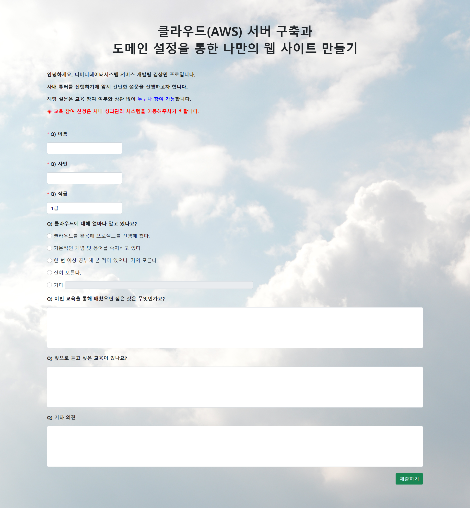
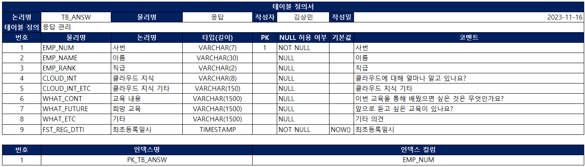
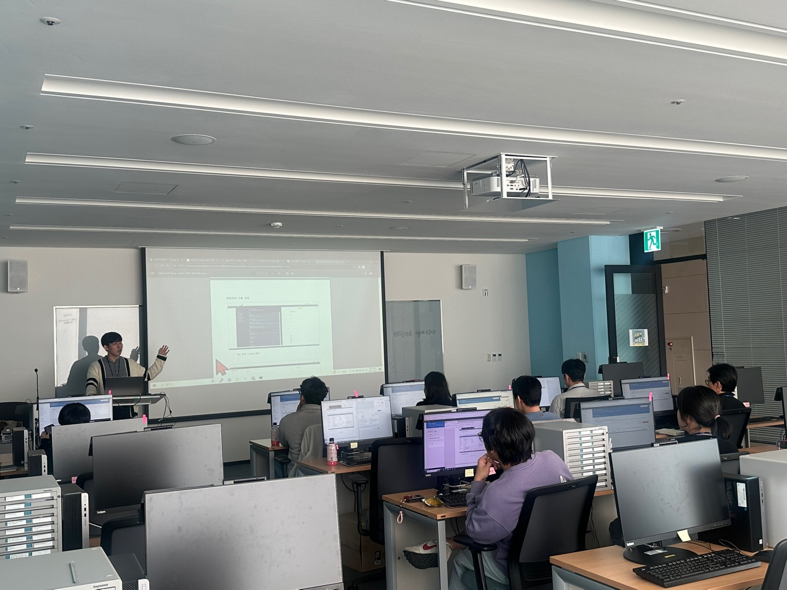
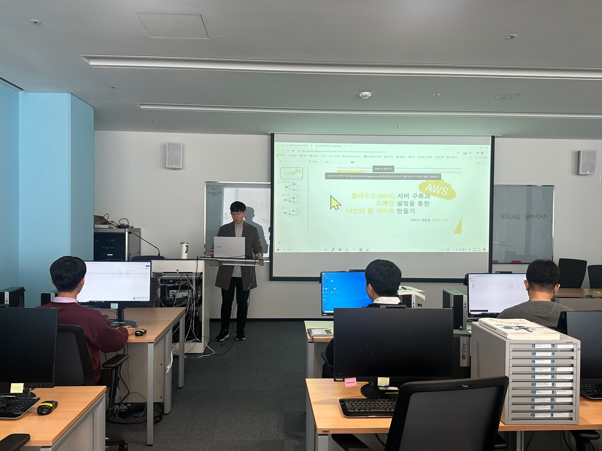

#   DGBDS CLOUD

## 프로젝트 목적

* 클라우드(AWS) 관련 사내 강연을 진행하기에 앞서 사전 조사를 진행하기 위한 웹 페이지를 구축한다.
* 프로젝트를 클라우드로 배포하여 사전 조사와 동시에 해당 강연을 통해 배울 수 있는 내용을 홍보한다.
* 배포주소: ~~https://dgbdscloud.click/~~ (사내 강연 후 제거)

## 개발환경

<table>
	<colgroup>
        <col width="30%" style="text-align:center">
        <col width="*">
    </colgroup>    
    <tbody>
    	<tr>
            <th style="text-align:center">LANGUAGE</th>
            <td>JAVA</td>            
        </tr>
        <tr>
            <th style="text-align:center">DB</th>
            <td>MySQL 8.0.33</td>            
        </tr>
        <tr>
            <th style="text-align:center">FRAMEWORK</th>
            <td>Spring 4.0</td>            
        </tr>
        <tr>
            <th style="text-align:center">IDE</th>
            <td>Eclipse 2022-09</td>            
        </tr>
        <tr>
            <th style="text-align:center">JDK</th>
            <td>OpenJDK 11</td>            
        </tr>
        <tr>
            <th style="text-align:center">WAS</th>
            <td>Tomcat 8.5</td>            
        </tr>
	</tbody>
</table>        

## 화면 구성

* 사용자는 인적 사항 및 물음에 대한 응답을 입력 후 제출한다.

## 테이블 명세서

 

 

 

# 사내 튜터 진행(사내 강연)

 

## 사내튜터란?

* 임직원 개인이 학습한 지식 및 기술을 직원들에게 공유함으로써 **‘공동역량’ 향상을 도모**하는 활동

 

## 활동 내용

1. 주제: 클라우드(AWS) 서버 구축과 도메인 설정을 통한 나만의 웹 사이트 만들기
2. 일시: 2023.11.28(화) 14:00 ~ 17:00(3시간)
3. 장소: DIC 1층 컴퓨터 강의실
4. 대상: 클라우드 및 웹 개발에 관심 있는 임직원

 

## 튜터 과정 상세

<table>
    <colgroup>
        <col width="10%">
        <col width="*">
        <col width="*">
    </colgroup>    
    <tbody>
        <tr>
            <th style="text-align:center">순번</th>         
            <th style="text-align:center">내용</th>
            <th style="text-align:center">교안</th>            
        </tr>
        <tr>
            <td style="text-align:center">1</td>
            <td style="text-align:left">
                <b>AWS회원가입</b>   
            </td>
            <td style="text-align:left">
                <a href="./사내튜터 자료/교안/part1_AWS회원가입.pdf">part1_AWS회원가입.pdf</a>
            </td>
        </tr>       
        <tr>
            <td style="text-align:center">2</td>
            <td style="text-align:left">
                <b>도메인 구매 및 네임서버  연결하기</b>   
                1.    가비아 도메인 구매   
                2.    Route 53 호스팅 영역 생성   
                3.    가비아 도메인과 AWS 네임서버 연결   
            </td>
            <td style="text-align:left">
                <a href="./사내튜터 자료/교안/part2_도메인 구매 및 네임서버 연결하기.pdf">part2_도메인 구매 및 네임서버 연결하기.pdf</a>
            </td>
        </tr>
        <tr>
            <td style="text-align:center">3</td>
            <td style="text-align:left">
                <b>클라우드 DB 생성하기</b>   
                1.	보안 그룹 설정   
                2.	RDS에 DB인스턴스 생성   
                3.	파라미터 그룹 생성   
                4.	DB접속 테스트
            </td>
            <td style="text-align:left">
                <a href="./사내튜터 자료/교안/part3_RDS로 DB 생성하기.pdf">part3_RDS로 DB 생성하기.pdf</a>
            </td>            
        </tr>
        <tr>
            <td style="text-align:center">4</td>
            <td style="text-align:left">
                <b>클라우드 서버 구축하기</b>   
                1.	EC2 인스턴스 생성   
                2.	탄력적 IP 할당   
                3.	EC2 연결 테스트   
                4.	Tomcat 설치
            </td>
            <td style="text-align:left">
                <a href="./사내튜터 자료/교안/part4_EC2로 서버 구축하기.pdf">part4_EC2로 서버 구축하기.pdf</a>
            </td>            
        </tr>    
        <tr>
            <td style="text-align:center">5</td>
            <td style="text-align:left">
                <b>https 적용하기</b>   
                1.	SSL 인증서 발급   
                2.	로드 밸런서 설정하기
            </td>
            <td style="text-align:left">
                <a href="./사내튜터 자료/교안/part5_SSL적용하기.pdf">part5_SSL적용하기.pdf</a>
            </td>             
        </tr>      
        <tr>
            <td style="text-align:center">6</td>
            <td style="text-align:left">
                <b>프로젝트 배포하기</b>   
                1. 소스 파일 수정    
                2. 데이터베이스 생성    
                3. 프로젝트 배포
            </td>
            <td style="text-align:left">
                <a href="./사내튜터 자료/교안/part6_프로젝트 배포하기.pdf">part6_프로젝트 배포하기.pdf</a>
            </td>             
        </tr>          
    </tbody>
</table>

# 신입사원 교육 진행

## 교육 내용

1. 주제: 클라우드(AWS) 서버 구축과 도메인 설정을 통한 나만의 웹 사이트 만들기
2. 일시: 2024.01.09(화) 13:00 ~ 17:00(4시간)
3. 장소: DIC 1층 컴퓨터 강의실
4. 대상: 신규 입사자
